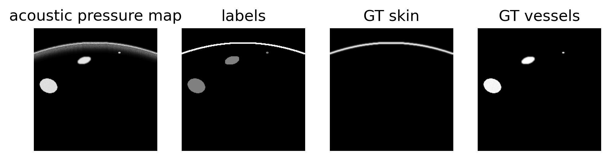

# OA-armsim

[](https://renkulab.io/projects/firat.ozdemir/oa-armsim/sessions/new?autostart=1)
[](https://opensource.org/licenses/MIT)

OA-armsim is a python module to simulate synthetic forearm acoustic pressure maps.   
The code here implements the acoustic map generation for the simulated cylinder dataset (SCD) presented in Berkan Lafci, Firat Ozdemir, Xosé Luís Deán-Ben, Daniel Razansky, and Fernando Perez-Cruz. OADAT: Experimental and synthetic clinical optoacoustic data for standardized image processing. arXiv preprint arXiv:2206.08612, 2022. 

## Demo

A demo file showcasing how to generate synthetic acoustic pressure maps and ground truth annotation maps of background, vessels, and skin curve is shown in file [demo.ipynb](notebooks/demo.ipynb)

 

## Use

Using GenerateVesselsAndSkinAndMasks class under [src/utils.py](src/utils.py), first define an object with the desired hyperparameters. 
Then use generate() attribute of the object.   
Example use:
```python
seed=99
resolutionXY = 256 ## acoustic pressure map is a square 
cylinder_size_max = 15 # pixels
cylinder_size_min = 1 # pixels
max_depth_cylinder_from_skin = 90
numEllipsesMax = 8 #not used anymore
lims_rot_x = 80 ## max rotation along x-axis (axis parallel to skinline), high values can lead to vessels being parallel to imaging plane  
lims_rot_y = 30 ## max rotation along y-axis (axis orthogonal to skinline)
behind_skin_noise = True
skin_noise_min = 10 #pixels
skin_noise_max = 40 #pixels
vessel_noise = True
prng = np.random.RandomState(seed)
sim_ellipses_obj = utils.GenerateVesselsAndSkinAndMasks(resolutionXY=resolutionXY, cylinder_size_max=cylinder_size_max, cylinder_size_min=cylinder_size_min, max_depth_cylinder_from_skin=max_depth_cylinder_from_skin, numEllipsesMax=numEllipsesMax, lims_rot_x=lims_rot_x, lims_rot_y=lims_rot_y, skin_noise_min=skin_noise_min, skin_noise_max=skin_noise_max, behind_skin_noise=behind_skin_noise, vessel_noise=vessel_noise, prng=prng)  
acoustic_pressure_map, gt_multichannel = sim_ellipses_obj.generate()

gt_skin, gt_vessels = gt_multichannel[...,0], gt_multichannel[...,1]
labels = utils.process_vessel_and_skinline(v=gt_vessels, sl=gt_skin)
# Picture above has output in the order (acoustic_presure_map, labels, gt_skin, gt_vessels)
```

## Citation  

Please cite to this work using the following Bibtex entry:
```
@article{lafci2022oadat,
  doi = {10.48550/ARXIV.2206.08612},
  url = {https://arxiv.org/abs/2206.08612},
  author = {Lafci, Berkan and Ozdemir, Firat and Deán-Ben, Xosé Luís and Razansky, Daniel and Perez-Cruz, Fernando},
  title = {{OADAT}: Experimental and Synthetic Clinical Optoacoustic Data for Standardized Image Processing},
  publisher = {arXiv},
  year = {2022},
  copyright = {Creative Commons Attribution Non Commercial Share Alike 4.0 International},
  journal={arXiv preprint arXiv:2206.08612},
}
```